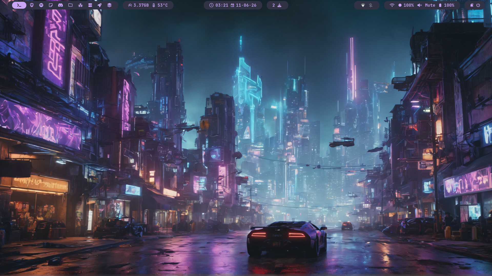
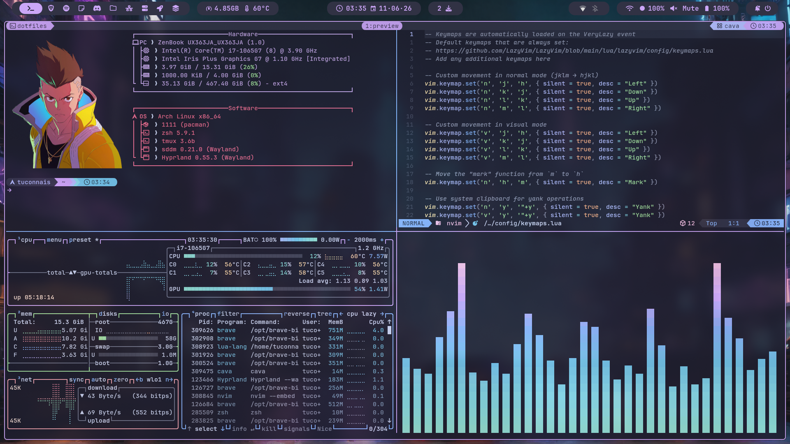
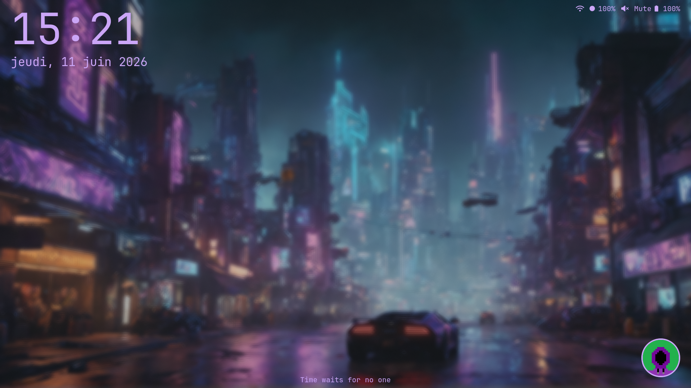
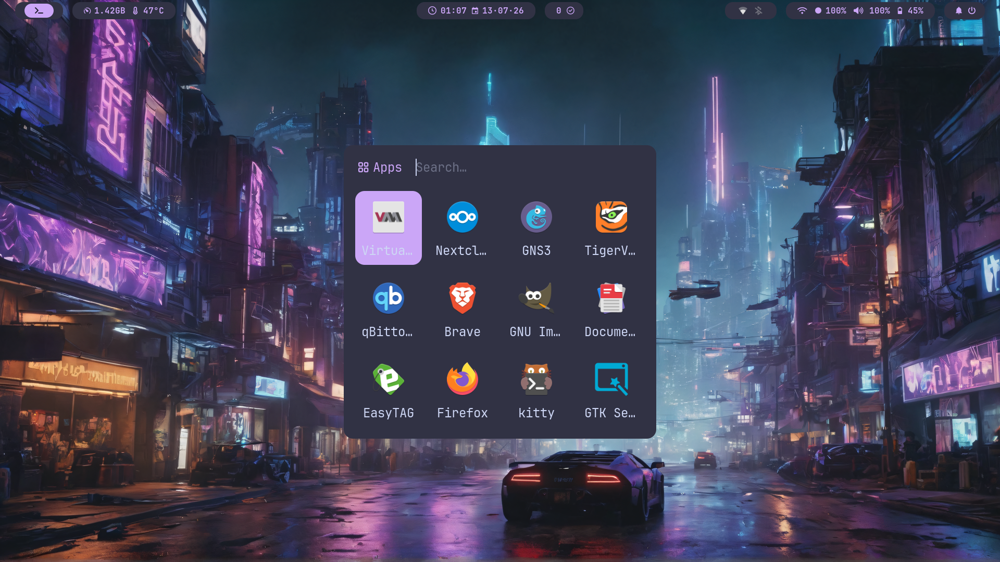
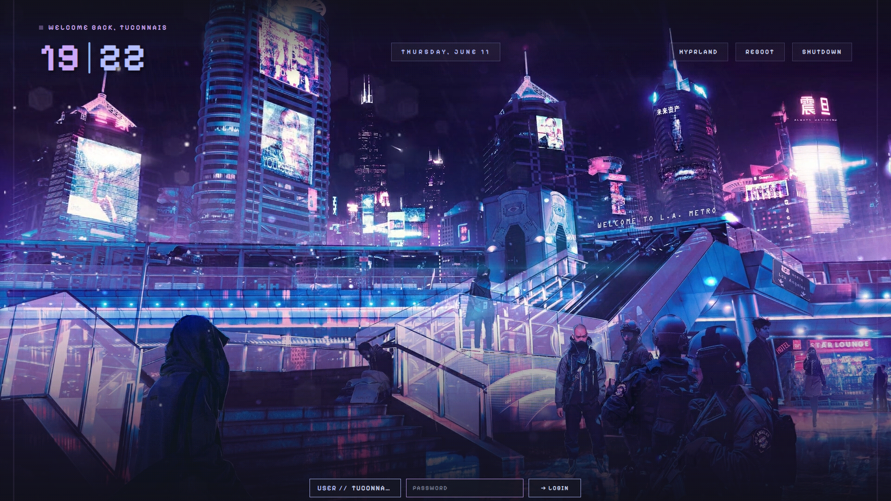
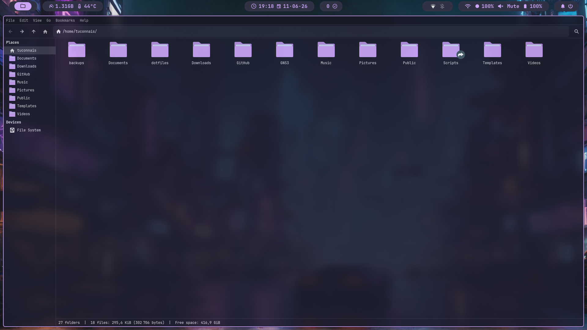
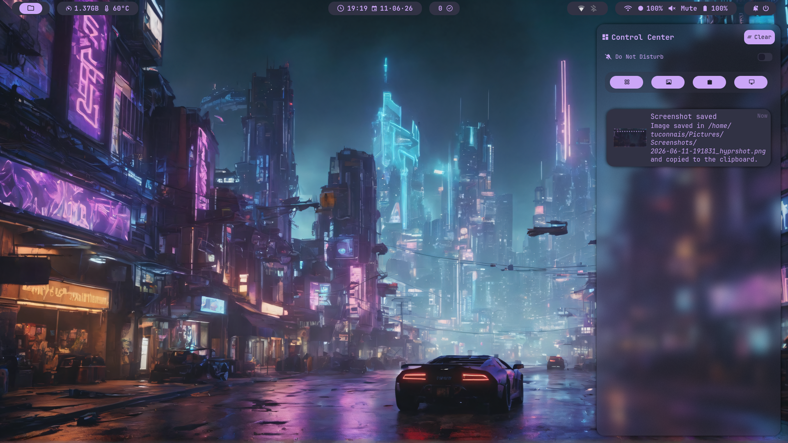
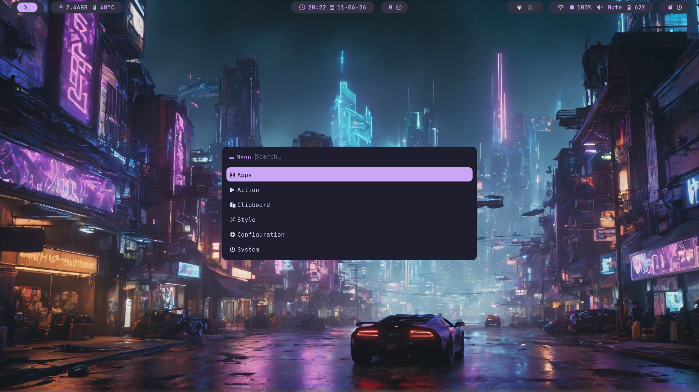
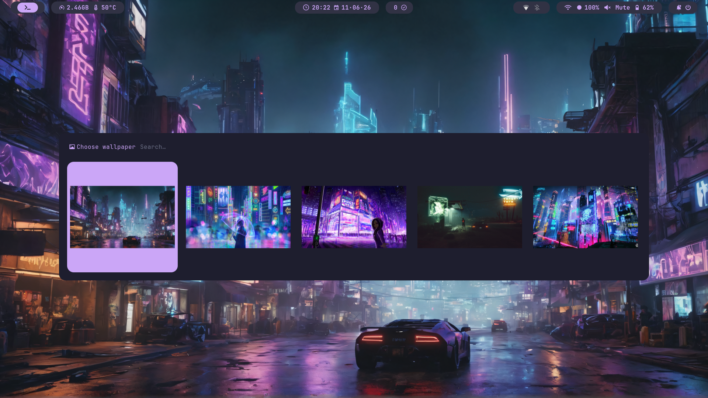
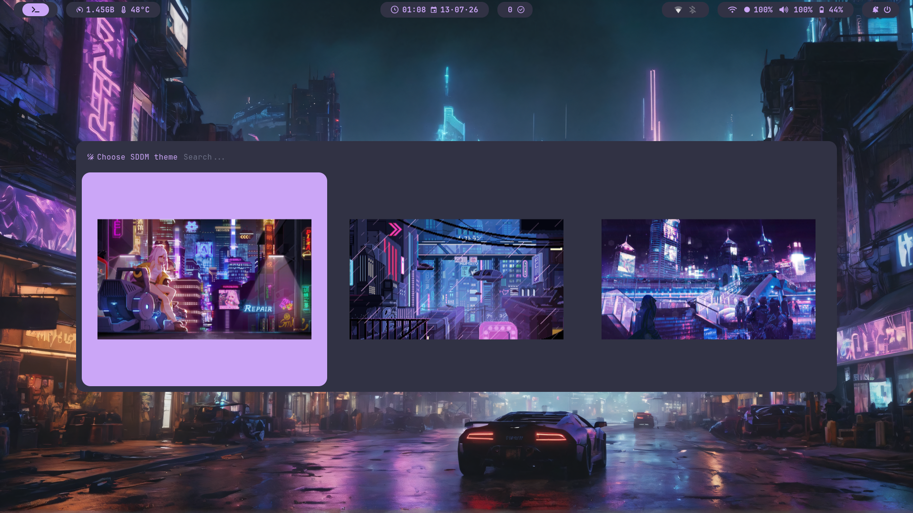

# 🌆 HyprPunk

> Arch Linux dotfiles for Hyprland, with a cyberpunk visual direction, Catppuccin Mocha colors, and Mauve accents.

HyprPunk is a complete personal Wayland setup built around **Hyprland**.  
It brings together the window manager, bars, menus, themes, scripts, terminal, shell, and CLI tools in a modular **GNU Stow** based configuration.

The goal is simple: a cohesive, dark, readable, and responsive desktop inspired by cyberpunk visuals without getting in the way of daily work.

---

## 🖼️ Screenshots

| Desktop | Tmux |
|:-:|:-:|
|  |  |
| Hyprlock | Rofi |
|  |  |
| SDDM | Thunar |
|  |  |
| Swaync | System Menu |
|  |  |
| Wallpaper Selector | SDDM Theme Selector |
|  |  |

---

## 🧰 What Is Included?

- 🪟 **Hyprland** as the main Wayland environment.
- 📊 **Waybar** with laptop and desktop variants.
- 🚀 **Rofi** menus for system actions, screenshots, clipboard history, wallpapers, SDDM themes, and Hyprland configuration.
- 🔒 **Hyprlock**, **Hypridle**, and **Hyprpaper** for lock screen, idle handling, and wallpapers.
- 🎬 **SDDM** with cyberpunk video themes.
- 💻 **Kitty**, **Zsh**, **Starship**, **Tmux**, and **Yazi** for the terminal workflow.
- 📝 **Neovim** with a Lua-based configuration.
- 🎨 **GTK 3/4**, **Qt5/Qt6**, and **Kvantum** themed around Catppuccin Mocha.
- 🛠️ **SwayNC**, **SwayOSD**, **Cliphist**, **Fastfetch**, **Btop**, **Cava**, **Bat**, and utility scripts.
- 📦 Modular configuration managed with GNU Stow.

---

## 🎨 Visual Identity

HyprPunk uses **Catppuccin Mocha** as its dark base and **Mauve** as the main accent color.

Core palette:

- 🌑 Base: `#1e1e2e`
- 🌘 Mantle: `#181825`
- 🌌 Crust: `#11111b`
- ✨ Text: `#cdd6f4`
- 💜 Mauve: `#cba6f7`
- 🪻 Lavender: `#b4befe`

The overall look favors soft contrast, mauve borders, dark surfaces, compact menus, and night-city inspired visuals.

---

## ✅ Installation

> [!CAUTION]
> The installer is designed for a fresh minimal Arch Linux installation.
>
> It may remove or replace existing user configurations, modify SDDM and GRUB, install system packages, and enable services. Read the script before running it on an existing desktop setup.

Run the installer:

```sh
sh -c "$(curl -fsSL https://raw.githubusercontent.com/tuconnaisyouknow/HyprPunk/refs/heads/master/install.sh)"
```

During installation, the script asks whether the machine is a **laptop** or a **desktop** and selects the matching modules:

- 📊 `waybar` or `waybar-desktop`
- 🔒 `hyprlock` or `hyprlock-desktop`

Reboot after the installation completes.

---

## 🧩 Manual Installation

Clone the repository:

```sh
git clone https://github.com/tuconnaisyouknow/HyprPunk.git ~/.dotfiles
cd ~/.dotfiles
```

Install the modules with Stow:

```sh
stow --target "$HOME" avatars bat btop cava fastfetch gtk3 gtk4 hypridle hyprland hyprlock hyprpaper kitty kvantum less nvim qt5 qt6 rofi scripts starship swaync tmux wallpapers waybar yazi zsh
```

For a desktop machine, use the desktop variants:

```sh
stow --target "$HOME" avatars bat btop cava fastfetch gtk3 gtk4 hypridle hyprland hyprlock-desktop hyprpaper kitty kvantum less nvim qt5 qt6 rofi scripts starship swaync tmux wallpapers waybar-desktop yazi zsh
```

---

## 📁 Structure

```text
.
├── avatars/             # User avatars
├── bat/                 # Bat configuration and Catppuccin theme
├── btop/                # Btop configuration and theme
├── cava/                # Audio visualizer configuration, shaders, and themes
├── fastfetch/           # Fastfetch system summary configuration and logo
├── grub/                # GRUB CyberEXS theme
├── gtk3/                # GTK 3 theme settings
├── gtk4/                # GTK 4 theme settings
├── hypridle/            # Hypridle idle behavior
├── hyprland/            # Hyprland Lua configuration
├── hyprlock/            # Laptop lock screen
├── hyprlock-desktop/    # Desktop lock screen
├── hyprpaper/           # Wallpaper daemon configuration
├── kitty/               # Kitty terminal configuration
├── kvantum/             # Kvantum Catppuccin Mocha Mauve theme
├── less/                # Less keybindings
├── nvim/                # Neovim Lua configuration
├── qt5/                 # Qt5 theme settings
├── qt6/                 # Qt6 theme settings
├── rofi/                # Rofi menus and themes
├── scripts/             # System, Rofi, and Hyprlock helper scripts
├── sddm/                # SDDM cyberpunk video themes
├── starship/            # Starship prompt configuration
├── swaync/              # SwayNC notification center configuration
├── tmux/                # Tmux configuration
├── wallpapers/          # Cyberpunk wallpapers
├── waybar/              # Laptop Waybar configuration
├── waybar-desktop/      # Desktop Waybar configuration
├── yazi/                # Yazi file manager configuration and theme
└── zsh/                 # Shell, aliases, bindings, and functions
```

Each directory is a Stow module that symlinks into `$HOME`.

---

## ⌨️ Keyboard Layout

> [!NOTE]
> These dotfiles are designed for an **AZERTY FR** keyboard layout.

To keep the workflow consistent with this layout, Vim-style movements are remapped from `h j k l` to `j k l m` across several tools.

If you use QWERTY or another layout, check at least:

- 🪟 `hyprland/.config/hypr/hyprland.lua`
- ⌨️ `hyprland/.config/hypr/keybindings.lua`
- 📖 `less/.lesskey`
- 📝 `nvim/.config/nvim/lua/config/keymaps.lua`
- 💻 `tmux/.config/tmux/tmux.conf`
- 🐚 `zsh/.zshrc`

In Hyprland, also adjust:

```lua
kb_layout = "fr"
```

---

## 🚀 Rofi Scripts

HyprPunk includes several Rofi menus to control the system from the keyboard:

- ⚙️ system menu
- 📸 screenshots
- 📋 clipboard history
- 🖼️ wallpaper selection
- 🎬 SDDM theme selection
- 🪟 Hyprland configuration
- 🖥️ monitor management
- ⏻ power options

Scripts are located in:

```text
scripts/Scripts/Rofi/
```

---

## ⚙️ System Services And Components

The installer enables or configures:

- 🌐 `NetworkManager`
- 🎬 `sddm`
- 🔊 `swayosd-libinput-backend.service`
- 🧱 `xwayland-satellite.service`
- 🔑 `gnome-keyring`
- 🎨 GTK, Qt, and Kvantum themes
- 📁 Papirus Dark icons with Catppuccin Mocha Mauve folders
- 🕹️ CyberEXS GRUB theme when GRUB is present

---

## 🔧 Customization

The main files to adapt to your machine are:

- 🖥️ `hyprland/.config/hypr/monitors.lua` for displays.
- ⌨️ `hyprland/.config/hypr/keybindings.lua` for keybindings.
- 🪟 `hyprland/.config/hypr/hyprland.lua` for window rules and workspaces.
- 🖼️ `wallpapers/Pictures/Wallpapers/` for wallpapers.

---

## 🚧 Roadmap

- ⌨️ Document the main keybindings.
- 📦 Add a dependency table per module.
- 🩺 Add troubleshooting notes for SDDM, Waybar, Rofi, and Hyprland.
- 🌆 Update the installer to use the `HyprPunk` name everywhere.
- ♻️ Add uninstall or backup restore instructions.

---

## 🙏 Credits

- 🕹️ The CyberEXS GRUB theme comes from [HenriqueLopes42/themeGrub.CyberEXS](https://github.com/HenriqueLopes42/themeGrub.CyberEXS).
- 🎬 The SDDM themes are inspired by [Darkkal44/qylock](https://github.com/Darkkal44/qylock).

---

## 📎 Related

Looking for my Windows configuration?

[dotfiles-windows](https://github.com/tuconnaisyouknow/dotfiles-windows)

---

## 📜 License

MIT. Feel free to explore, fork, and adapt.
